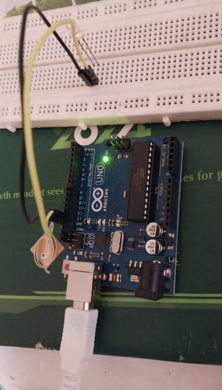
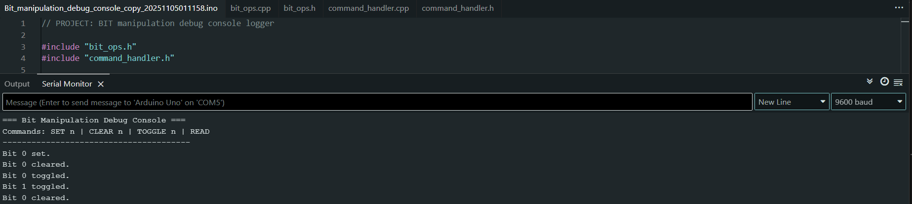
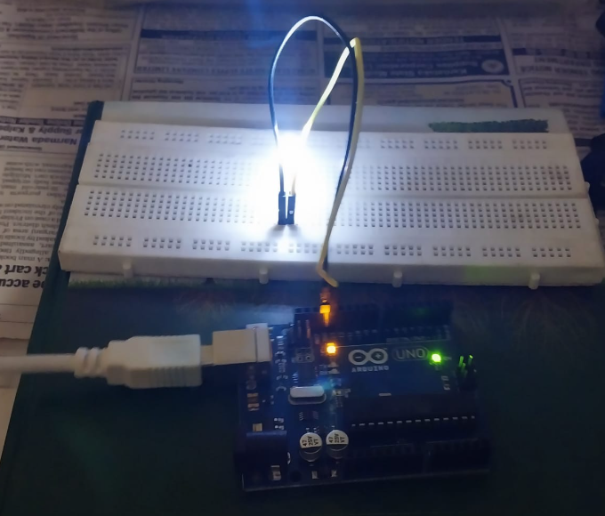

# Arduino Bit Manipulation Debug Console

A professional-grade Arduino Uno project demonstrating register-level bit manipulation through a serial command interface.

## 🎯 Features
- Virtual 8-bit register (`REG_A`)
- Serial command interface (`SET`, `CLEAR`, `TOGGLE`, `READ`)
- Built-in input validation and error handling
- Modular C++ firmware design (`bit_ops`, `command_handler`)
- LED reflects bit 0 of the virtual register

## 🧩 Commands
| Command | Description | Example |
|----------|--------------|----------|
| `SET n` | Sets bit `n` | `SET 3` |
| `CLEAR n` | Clears bit `n` | `CLEAR 0` |
| `TOGGLE n` | Toggles bit `n` | `TOGGLE 1` |
| `READ` | Prints the binary value of the register | `READ` |

## ⚙️ Hardware
- Arduino Uno board  
- 1 LED + 220Ω resistor (connected to digital pin 13 or 8)  
- Common GND connection  

**Circuit:**

## 📘 How to Use
1. Upload the code to your Arduino Uno  
2. Open the Serial Monitor (9600 baud)  
3. Enter commands like:

 -> SET 0
    READ
    TOGGLE 0
    CLEAR 0

Output : 

1. User gives input to serial monitor console with the values of 
    -> SET 0
    -> TOGGLE 0

    Then LED links 💡 !!!

    

2. And when bit is cleared using the command 

    -> CLEAR 0 

    LED turn OFF !!!

3. Each time you type `READ`, the console displays the current state of the **virtual 8-bit register** in binary     format.  
    This lets you visualize which bits are currently active (set to 1).

| Output Example | Meaning | Description |
|----------------|----------|--------------|
| `REG_A: 00000000` | All bits cleared | No bit is active — LED (bit 0) is **OFF** |
| `REG_A: 00000001` | Bit 0 set | LED (mapped to bit 0) is **ON** |
| `REG_A: 00001000` | Bit 3 set | Only bit 3 is active |
| `REG_A: 11111111` | All bits set | Every bit (0–7) is active |

## ⚠️ Error Handling & Failure Cases

The console is designed to reject invalid or incomplete commands gracefully.  
Below are all handled error scenarios:

| Command | Possible User Error | Failure Description | Console Response |
|----------|--------------------|---------------------|------------------|
| `SET` | Missing bit index | `SET` typed without a number | `Error: Missing bit index for SET` |
| `SET` | Non-numeric index | `SET A` or `SET two` | `Error: Invalid bit index for SET` |
| `SET` | Out of range (0–7) | `SET 9` | `Error: Bit index must be 0–7` |
| `CLEAR` | Missing index | `CLEAR` | `Error: Missing bit index for CLEAR` |
| `CLEAR` | Invalid index | `CLEAR X` | `Error: Invalid bit index for CLEAR` |
| `CLEAR` | Out of range | `CLEAR 10` | `Error: Bit index must be 0–7` |
| `TOGGLE` | Missing index | `TOGGLE` | `Error: Missing bit index for TOGGLE` |
| `TOGGLE` | Invalid index | `TOGGLE bit0` | `Error: Invalid bit index for TOGGLE` |
| `TOGGLE` | Out of range | `TOGGLE 12` | `Error: Bit index must be 0–7` |
| `READ` | Extra argument | `READ 2` | `Invalid command! Use: SET n | CLEAR n | TOGGLE n | READ` |
| Any other | Unknown command | e.g., `RESET`, `WRITE`, etc. | `Invalid command! Use: SET n | CLEAR n | TOGGLE n | READ` |
| Empty input | Pressing Enter with no text | — | (Ignored silently) |
